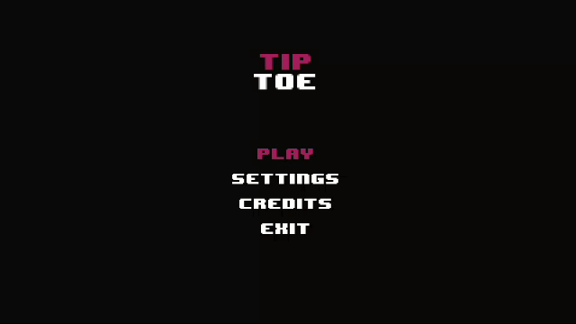
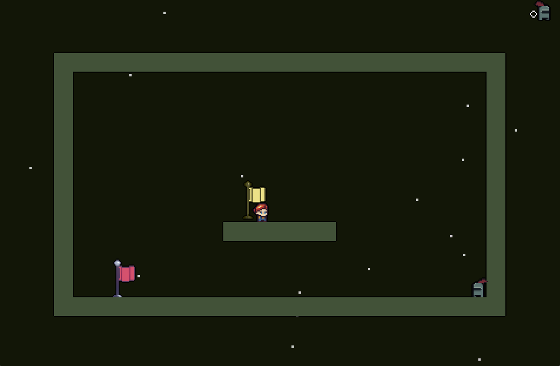
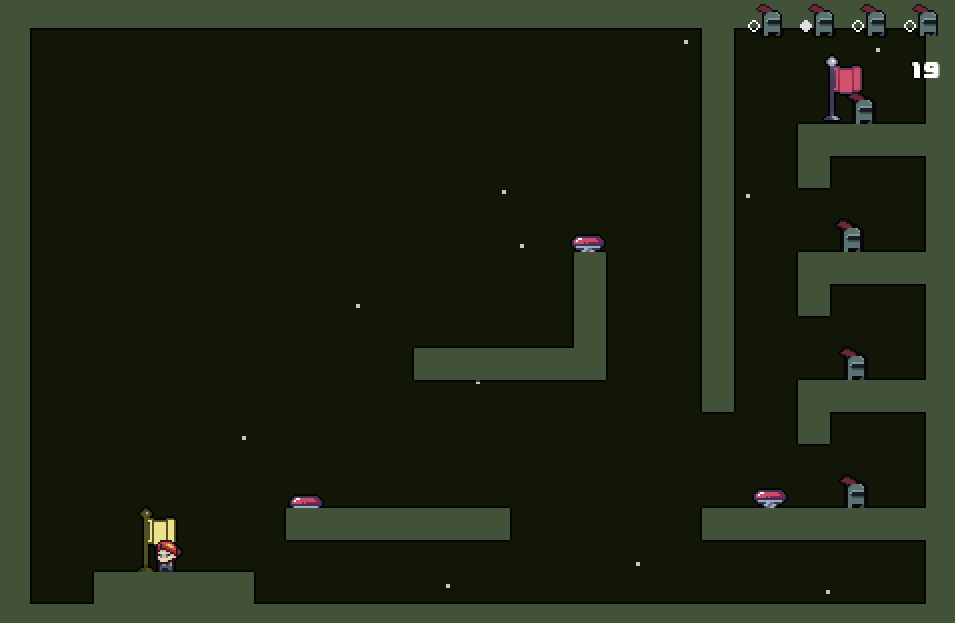

# tiptoe

Game inspired by the Summoning theme for the 55th ludum dare jam

**Early preview**...

## Features

- 2D Platformer
- 9 stages (levels)
- Speedrun timer _just-for-display_

## Controls

### Keyboard

- z: go to last checkpoint
- x: save position as checkpoint
- c | k: dash
- v | space: jump
- v-`<direction>` c: double jump dash
- b: delete last checkpoint
- enter(RET): Confirm actions
- wasd and arrow keys: move in direction (up left down right)

## Screenshots

<!-- GIF preview /archive/screenrec001.gif -->

## Build Prerequisites

NOTE: Last built with python 3.11.8

### Environment

Built in support for either `pip 23.2.1` or `nix-shell (Nix) 2.18.1`

### Requirements

- pygame

See more

#### Dev-dependencies

##### Build

- psutil

- pyinstaller
  - altgraph
  - packaging
  - pyinstaller-hooks-contrib

##### Testing

- hypothesis

  - attrs
  - sortedcontainers

- pytest
  - iniconfig
  - pluggy

##### Profiling

- line-profiler
- memory-profiler

## Developers

- [Lloyd Lobo](https://github.com/lloydlobo) - Design & Programming

## Credits

<!-- TODO -->

- See [/resources/LICENSE.md](./src/data/LICENSE.md)
- DaFluffyPotato for introduction and course on building a platformer using Pygame
- Raylib examples for inspiring the menu screen navigation
- Pygame for it's simple to use library APIs

## Links

## License

This game sources are licensed under an unmodified zlib/libpng license, which
is an OSI- certified, BSD-like license that allows static linking with closed
source software. Check LICENSE for further details.
