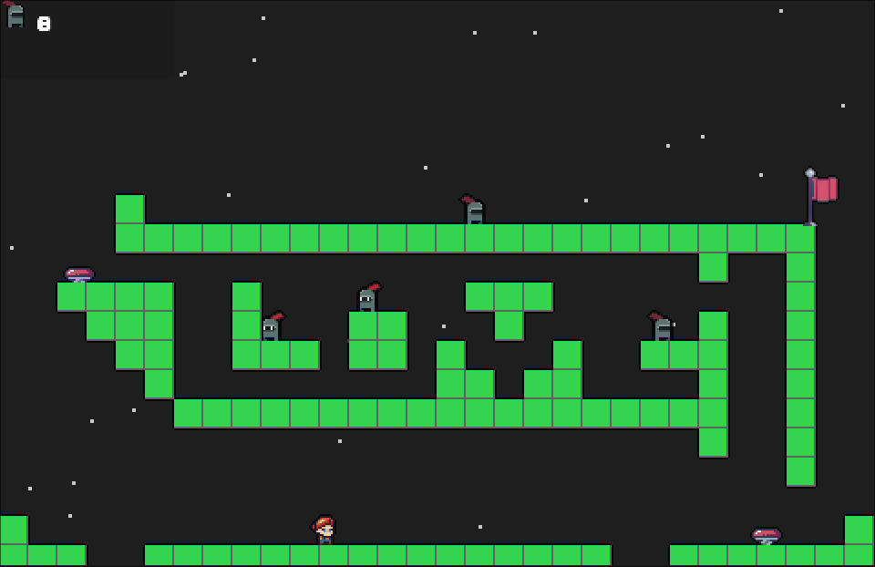

# tiptoe

**Early preview**...

## Features

- first
- second
- third

## Controls

### Keyboard

- WASD and Arrow keys: Move in direction (Up Left Down Right)
- SPACE: Float up
- X-`<direction>`: Dash
- ESCAPE:
- Access menu
- Return to previous menu
- Toggle gameplay/menu
- ENTER: Confirm actions

## Screenshots

<!-- GIF preview /archive/screenrec001.gif -->

## Build Prerequisites

NOTE: Built with python 3.11.8

### Environment

Built in support for either `pip 23.2.1` or `nix-shell (Nix) 2.18.1`

### Dependencies

- pygame

See more

#### Dev-dependencies

##### Build

- psutil

- pyinstaller
  - altgraph
  - packaging
  - pyinstaller-hooks-contrib

##### Testing

- hypothesis

  - attrs
  - sortedcontainers

- pytest
  - iniconfig
  - pluggy

##### Profiling

- line-profiler
- memory-profiler

## Developers

- [Lloyd Lobo](https://github.com/lloydlobo) - Design & Programming

## Credits

- Resources /resources/LICENSE.md

## Links

## License

This game sources are licensed under an unmodified zlib/libpng license, which
is an OSI- certified, BSD-like license that allows static linking with closed
source software. Check LICENSE for further details.
